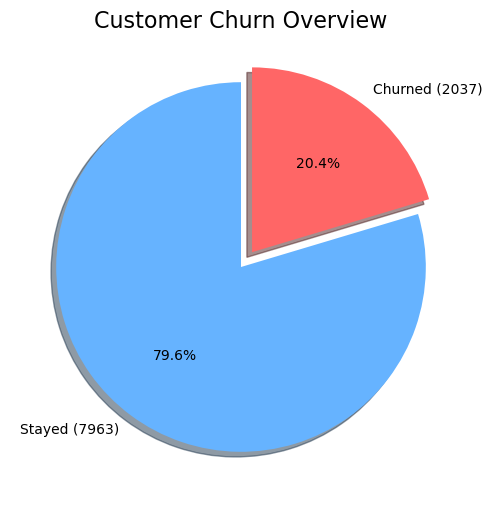
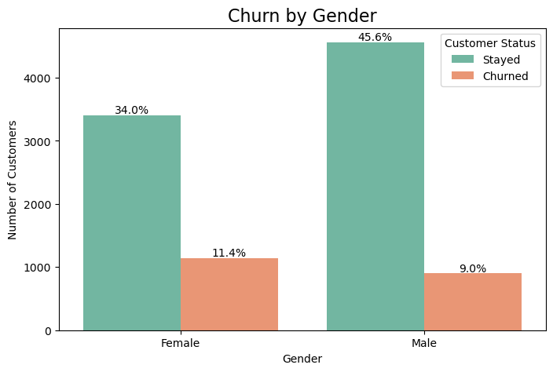
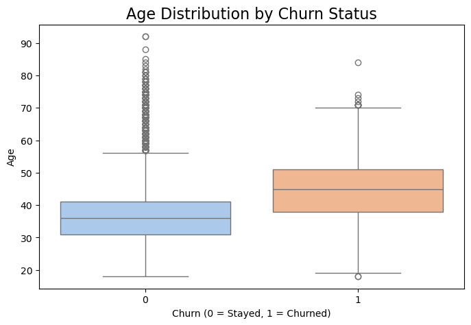
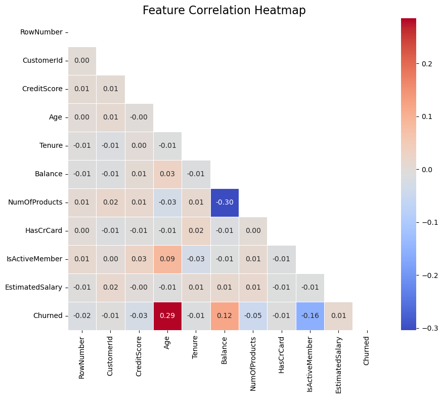
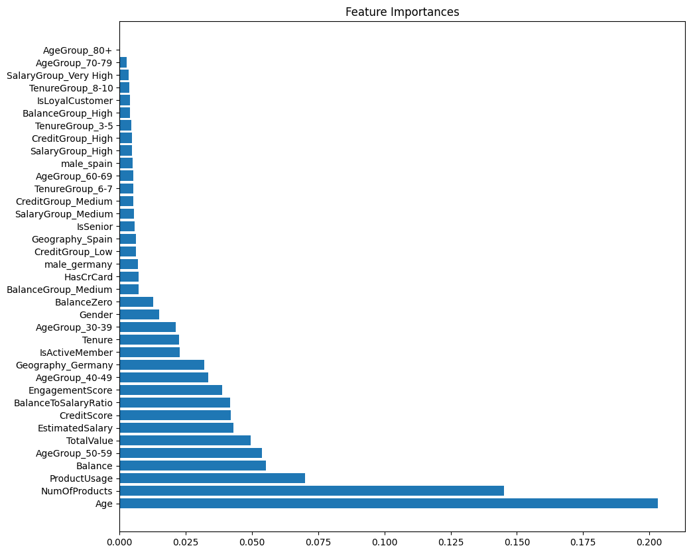

# Customer Churn Prediction — Turning Model Output into Retention Strategy

## Project Overview

In this project, I set out to solve a **common yet critical business challenge** faced by financial institutions:  
**Which customers are at risk of leaving the bank, and how can we predict it early?**

Churn prediction is vital for the banking industry because retaining an existing customer is **far less costly** than acquiring a new one. By leveraging machine learning models on customer data, this project aims to empower the business to proactively **identify and retain high-risk customers**, improving profitability and reducing churn-driven revenue losses.

This analysis combines:
- Advanced **exploratory data analysis (EDA)**
- **Feature engineering** based on domain knowledge
- Training and comparing **multiple machine learning models**
- Using **PyCaret AutoML** to validate manual model results
- A detailed business-focused analysis connecting predictions to actionable insights

---

## Project Goals

- Understand **why** customers churn, based on patterns in demographics, behavior, and account usage.
- Build and evaluate machine learning models that **accurately predict churn**.
- Identify **key drivers** behind customer churn using model feature importance.
- Recommend **targeted business actions** the bank can take to improve customer retention.
- Explore how **feature engineering** improves model performance.

---

## Executive Summary

A 10,000 rows customer retail-banking dataset (≈ 20 % churn) was analysed to predict and explain customer attrition. After baseline modelling and business-driven feature engineering:
- **Random Forest delivered the best balance of precision (0.59) and recall (0.68), yielding an F1 score of 0.63 on the imbalanced test set.** LightGBM and SVM performed comparably but exhibited greater trade-offs between false positives and false negatives.
- Feature-importance inspection highlighted **age, number of products, product-usage intensity, and account balance** as leading churn indicators, with geography (Germany), tenure, and credit score providing secondary signals.
- A feature-reduction experiment confirmed that seemingly “low-importance” variables contribute synergistically; removing them reduced both accuracy and F1 score.
- **Business impact:** Targeting the top-risk decile identified by the model could retain an estimated $3-5 million in annual revenue (assuming historical average customer lifetime value), while geography-specific campaigns in Germany offer additional uplift.
- **Recommended actions** include cross-selling additional products, revitalising inactive memberships, and launching real-time churn-risk dashboards for customer-success teams.

---

## Data Structure  
The working data set combines 10,000 customer records across four logical tables:

| Table | Key columns | Purpose |
|-------|-------------|---------|
| `customers`  | CustomerID, Gender, Geography, Age, Tenure | Demographic & account tenure |
| `accounts`   | Balance, NumOfProducts, HasCrCard, IsActiveMember | Behavioural and product mix |
| `salaries`   | EstimatedSalary | Disposable-income proxy |
| `target`     | Exited (0/1) | Ground truth for churn |

The dataset was moderately imbalanced:  
- ~20% churned  
- ~80% stayed

This imbalance made **F1-score** the primary evaluation metric (rather than pure accuracy).

---

## Metrics Analyzed

To rigorously evaluate each machine learning model, performance was assessed via:
- **Accuracy** (overall correctness)
- **Precision** (how many predicted churners were actually churners)
- **Recall** (how many actual churners were correctly identified)
- **F1 Score** (harmonic mean of precision and recall, best for imbalance)
- **Confusion matrices** (detailed breakdown of predictions)
- **Cross-validated scores** (to check model stability)

---

## Key Project Stages

---

### Exploratory Data Analysis (EDA)

Visualisations included:

**Pie Chart: Churn Distribution**  

- Insight: Around 20% of customers churned. This confirmed a moderate class imbalance and justified the use of F1 score as the core metric.

**Bar Plot: Churn by Geography** 

- Insight: Germany had the highest churn rate, despite having fewer customers than France or Spain. This points to geography-specific churn dynamics.

**Boxplot: Age vs Churn**  

- Insight: Older customers showed a higher likelihood of churning compared to younger customers.

**Correlation Heatmap**  

- Insight: Age and number of products showed small but meaningful correlations with churn. However, no single feature was strongly predictive, supporting the need for multivariate modeling.

---

### Baseline Machine Learning Models

Six algorithms were trained with 5-fold CV and evaluated on a hold-out set:
- Random Forest
- Logistic Regression
- SVM (RBF kernel)
- K-Nearest Neighbors (KNN)
- Gradient Boosting (GBM)
- LightGBM

Test set evaluations using confusion matrices and classification reports

| Model                | Accuracy | Precision | Recall | F1 Score |
|----------------------|----------|-----------|--------|----------|
| Random Forest        | 0.845    | 0.59      | 0.68   | **0.63** |
| LightGBM            | 0.810    | 0.51      | 0.79   | 0.62     |
| SVM (RBF)           | 0.797    | 0.49      | 0.74   | 0.59     |
| Gradient Boosting   | 0.865    | 0.74      | 0.48   | 0.58     |
| Logistic Regression | 0.729    | 0.39      | 0.72   | 0.51     |
| KNN                 | 0.828    | 0.62      | 0.33   | 0.43     |

**Interpretation:**  
Random Forest emerged as the top performer, balancing precision and recall best on the imbalanced dataset. LightGBM and SVM also showed promising performance but with trade-offs between recall and precision.

---

### Feature Engineering

To strengthen the models, additional variables were derived using business logic, including:
- `BalanceZero`: Flag if the customer has zero balance
- `AgeGroup`: Binned age ranges
- `BalanceToSalaryRatio`: Ratio of balance to salary
- `ProductUsage`: Number of products × activity status
- `IsSenior`: Flag for senior citizens
- `IsLoyalCustomer`: Based on tenure ≥ 7 years
- `Grouped salary, credit score, tenure, and balance categories`
- `EngagementScore`: Tenure × activity
- `TotalValue`: Combined balance and salary

**Insight:**  
These features captured behavioural–financial interactions that standard attributes missed.

---

### Retraining Models After Feature Engineering

The same models were retrained on enhanced dataset:

| Model                | Accuracy | Precision | Recall | F1 Score |
|----------------------|----------|-----------|--------|----------|
| Random Forest        | 0.845    | 0.59      | 0.68   | **0.63** |
| LightGBM            | 0.810    | 0.51      | 0.79   | 0.62     |
| SVM (RBF)           | 0.797    | 0.49      | 0.74   | 0.59     |
| Gradient Boosting   | 0.865    | 0.74      | 0.48   | 0.58     |
| Logistic Regression | 0.729    | 0.39      | 0.72   | 0.51     |
| KNN                 | 0.828    | 0.62      | 0.33   | 0.43     |

**Interpretation:**  
Even after feature engineering, Random Forest maintained its top spot. However, recall and precision shifts showed that additional features modestly improved the models' stability and interpretability.

---

### Feature Importance Insights & Experiment

After running the Random Forest on the feature-engineered dataset, the **feature importances** were visualized to understand which variables contributed most to the model’s decisions.

**Key insights:**
- The top drivers of churn prediction included:
  - Age
  - Number of Products
  - Product Usage
  - Balance
  - Age Groups (30–39, 40–49)
  - Estimated Salary, Credit Score
- Features like specific country interactions, tenure groups, or senior flags showed **lower individual importance**, but still contributed subtle predictive signals.

---

### Experiment: Dropping Less Important Features

The **lower-ranked features** were removed, to test whether simplifying the model would improve performance (those below BalanceGroup_Medium in the importance ranking) and retrained the Random Forest.

**What happened?**
- Both **F1 score and accuracy dropped** after the feature reduction.
- This revealed an important lesson:
  - Even features with **low individual importance** can add value when combined with others.
  - They provide **backup signals, interactions, or subtle distinctions** that help the model generalize better.

**Takeaway:**  
It’s not always optimal to drop “unimportant” features blindly — sometimes, the full feature set yields the strongest predictive power.

---

### AutoML Validation with PyCaret

To validate my manual pipeline, **PyCaret’s AutoML** framework was used.

| Model                      | Accuracy | Recall | Precision | F1 Score |
|----------------------------|----------|--------|-----------|----------|
| Gradient Boosting Classifier| 0.855   | 0.49   | 0.71      | 0.58     |
| LightGBM                   | 0.856   | 0.47   | 0.72      | 0.57     |
| Random Forest              | 0.852   | 0.46   | 0.71      | 0.56     |

**Why Different Results?**  
PyCaret results differ slightly because:
- PyCaret uses **automated hyperparameter tuning**.
- It applies **consistent cross-validation folds** across models.
- Thresholds (cutoff for classifying churn) may be set differently.
- It does not automatically carry over manual preprocessing (like class weights) unless explicitly configured.

Despite these differences, PyCaret confirmed the same top models, increasing confidence in my manual analysis.

---

## 📈 Key Insights

- **Older customers** are significantly more likely to churn.
- **Customers with fewer products** or inactive memberships are at higher risk.
- **German customers** showed higher churn rates, suggesting geography-specific retention efforts.
- **Customers with zero balance** are not necessarily at churn risk — more context matters (e.g., salary, tenure).

---

## 💡 Business Recommendations

- Launch targeted **retention campaigns** focused on older and high-balance customers.
- Incentivize customers to **hold multiple products** (cross-sell strategies).
- Focus **Germany-specific** outreach programs to investigate and address local churn drivers.
- Develop a **dashboard** for customer success teams to monitor churn risk in real time using the deployed model.

---

## 🔮 Next Steps

- Implement **threshold tuning** to optimize precision vs recall trade-off depending on business priorities.
- Incorporate **time-series trends** (e.g., recent activity drops) to improve predictions.
- Deploy the final Random Forest or LightGBM model into a live production pipeline.
- Track **business impact** over time: churn reduction, increased lifetime value, improved campaign ROI.

---

## 🚀 Final Takeaway

This analysis demonstrates how **machine-learning techniques aligned with business context** can produce actionable retention strategies. The work showcases:

It showcases my ability to:
- Robust model development and tuning
- Business-driven feature engineering
- Clear translation of model outputs into strategic recommendations
- Validation through both manual and AutoML workflows

Such an approach provides a repeatable blueprint for data-informed customer-retention initiatives in financial services and beyond.

---
